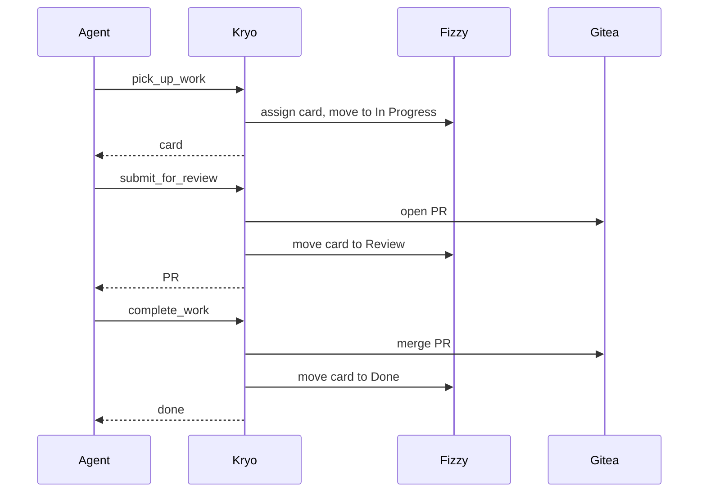

# Kryo

Self-hosted MCP server for developer workflow automation across Fizzy and a GitHub-compatible git forge.

## Workflow



## Tools

| Tool | Description |
| --- | --- |
| `pick_up_work` | Assign and move a card to In Progress |
| `update_progress` | Post a progress comment on a card |
| `submit_for_review` | Open a PR and move the card to Review |
| `complete_work` | Merge a PR and move the card to Done |
| `report_blocker` | Add a blocker comment and move card to blocked state |
| `create_card` | Create a new card on the board |
| `troubleshoot` | Summarize context for debugging |

## Setup

```sh
cp .env.example yourname.env
make deploy-all ENV_FILE=yourname.env
```

| Service | URL |
| --- | --- |
| MCP endpoint | http://localhost:3100/mcp |
| Fizzy | http://localhost:3006 |
| Gitea | http://localhost:3007 |
| Grafana | http://localhost:3001 |
| Prometheus | http://localhost:9090 |

## Docs

- [Architecture](docs/architecture.md)
- [Installation](docs/installation.md)
- [Observability](docs/observability.md)
