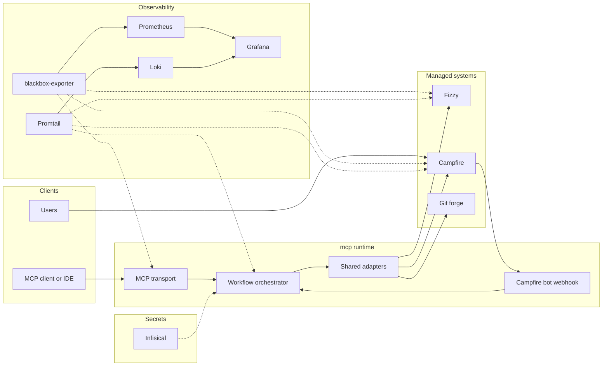
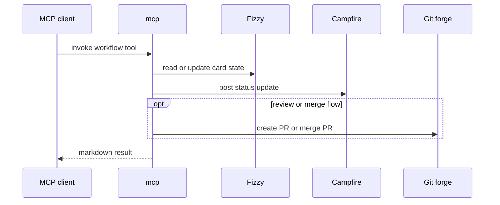
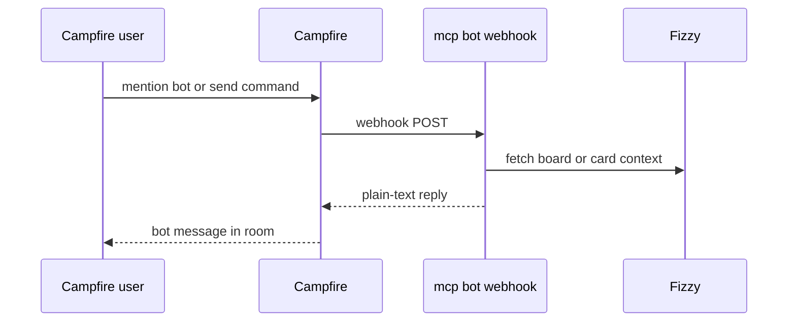

# Architecture

## Runtime Shape

`kryo` packages:

- MCP server
- Campfire bot webhook handler
- shared workflow layer
- shared adapters for Fizzy, Campfire, and the configured git forge

The project is container-first and intended to run unchanged across local Compose, CI, and cloud container platforms.

## System Diagram

The layout below follows the same broad pattern as the Prometheus architecture overview: a central runtime with surrounding producers, consumers, and supporting systems.



## Core Flow

```text
MCP client or IDE agent
  -> stdio or streamable HTTP
  -> mcp
  -> workflow layer
  -> adapters
  -> Fizzy / Campfire / git forge
```

## MCP Tool Sequence



## Campfire Bot Sequence



## HTTP Transport

Supported modes:

- `stdio`
- `streamable-http`

For `streamable-http`, the session strategy is explicit:

- `MCP_HTTP_SESSION_MODE=stateful`
  - in-process session storage
  - bounded by `MCP_SESSION_IDLE_TTL_MS` and `MCP_MAX_SESSIONS`
  - best for single-instance local use
- `MCP_HTTP_SESSION_MODE=stateless`
  - fresh MCP server per request
  - safer for non-sticky or multi-replica deployments

Inbound HTTP requests are also validated against `MCP_ALLOWED_HOSTS` before either the MCP transport or Campfire webhook handler runs.

## Service Boundaries

- `kryo`
  - orchestration and HTTP surfaces
- `fizzy`
  - board/card system of record
- `campfire`
  - chat and bot webhook integration
- git forge
  - PR and merge lifecycle
