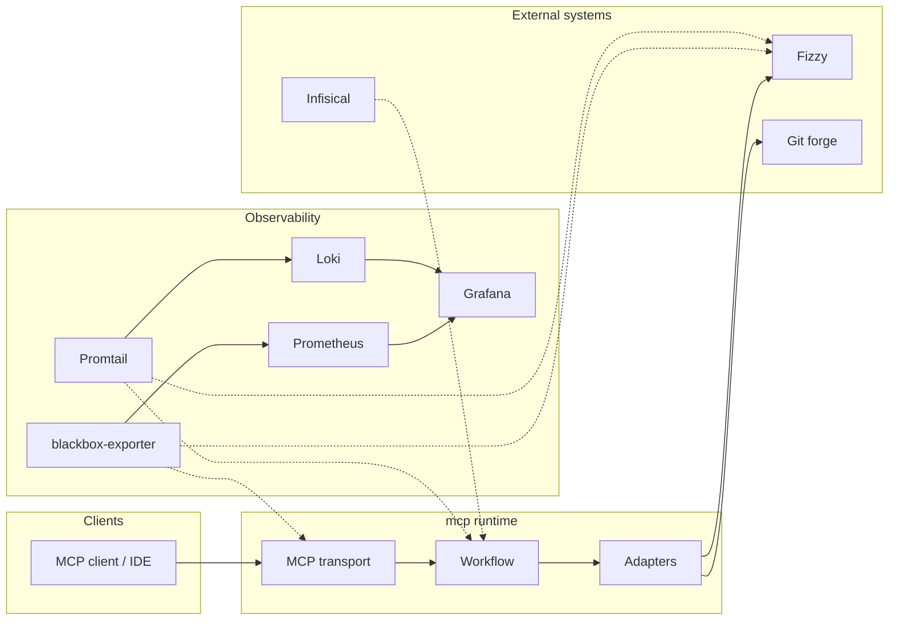
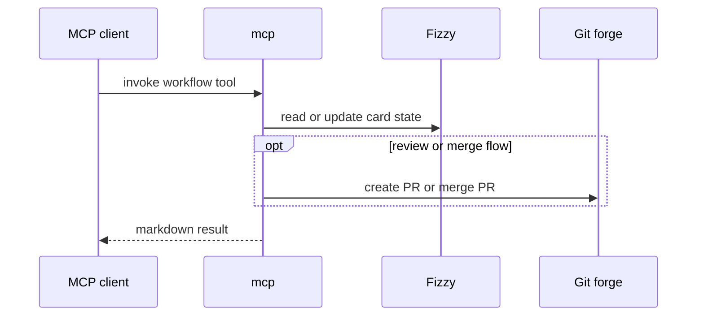

# Architecture

## Runtime Shape

`kryo` packages:

- MCP server (tools, resources, prompts)
- shared workflow layer
- shared adapters for Fizzy and the configured git forge

The project is container-first and intended to run unchanged across local Compose, CI, and cloud container platforms.

## System Diagram



## Core Flow

```text
MCP client or IDE agent
  -> stdio or streamable HTTP
  -> mcp
  -> workflow layer
  -> adapters
  -> Fizzy / git forge
```

## MCP Capabilities

Registered in `src/server.ts`:

**Tools**

| Tool | Description |
|---|---|
| `pick_up_work` | Assign next card and move to In Progress |
| `update_progress` | Post a progress comment on a card |
| `submit_for_review` | Open a PR and move card to Review |
| `complete_work` | Merge PR and move card to Done |
| `report_blocker` | Add blocker comment and move card to Blocked |
| `create_card` | Create a new card on the board |
| `troubleshoot` | Surface context for debugging |

**Resources**

| Resource | Description |
|---|---|
| `board-status` | Live snapshot of board card state (`src/resources/board-status.ts`) |

**Prompts**

| Prompt | Description |
|---|---|
| `code-review` | Structured code review prompt |
| `bug-triage` | Structured bug triage prompt |

## MCP Tool Sequence



## HTTP Transport

Supported modes:

- `stdio`
- `streamable-http`

For `streamable-http`, the session strategy is explicit:

- `MCP_HTTP_SESSION_MODE=stateful`
  - in-process session storage
  - bounded by `MCP_SESSION_IDLE_TTL_MS` and `MCP_MAX_SESSIONS`
  - best for single-instance local use
- `MCP_HTTP_SESSION_MODE=stateless`
  - fresh MCP server per request
  - safer for non-sticky or multi-replica deployments

Inbound HTTP requests are validated against `MCP_ALLOWED_HOSTS` before the MCP transport runs.

## Local LLM Demo

`make/llm.mk` manages a host-side vllm-mlx process (Apple Silicon). `scripts/demo-agent.py` is a Python agent that drives the 3-step workflow loop directly against the MCP HTTP endpoint:

```text
pick_up_work → submit_for_review → complete_work
```

Entry point: `make llm-demo ENV_FILE=yourname.env`

See [Installation](installation.md) for the full target reference.

## Service Boundaries

- `kryo` — orchestration and MCP HTTP surface
- `fizzy` — board/card system of record
- git forge — PR and merge lifecycle
